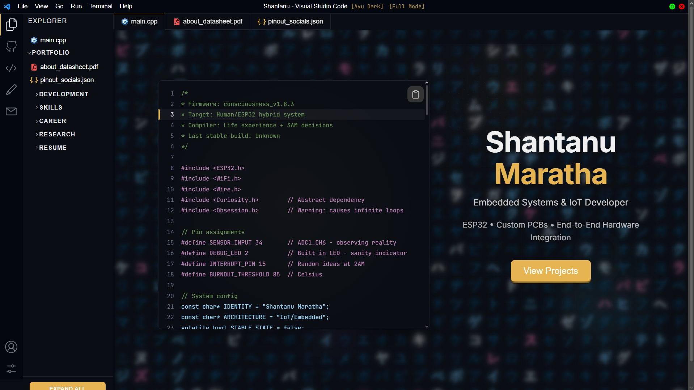

# 💻 VS Code Portfolio

**My portfolio, but make it look like the editor I actually use**

[🌐 Live Site](https://shantanu-vsc-portfolio.vercel.app) • [🐛 Found a Bug?](https://github.com/shaxntanu/VSCode-Portfolio/issues) • [💡 Got Ideas?](https://github.com/shaxntanu/VSCode-Portfolio/issues)

  
---

## What's This?

I spend most of my time in VS Code building hardware and firmware, so I figured — why not make my portfolio look like it too?

This isn't just another themed website. It actually mimics VS Code's interface with a working file explorer, tabs, sidebar navigation, and even a terminal-style resume viewer. The home page shows Arduino/C++ pseudo-code that describes how I work (spoiler: lots of debugging, coffee, and the occasional "why isn't this working?" moment).

Built with Next.js because I wanted something fast and SEO-friendly. The web development part was mostly AI-assisted since my real passion is embedded systems and IoT hardware — I'd rather be soldering than styling CSS.

## What's Inside

**Pages:**
- **Home** - Pseudo-code that won't compile but tells you how I think
- **About** - Who I am, what I build, and why (with a world map because why not)
- **Projects** - Hardware modules, IoT systems, and some web dashboards
- **Resume** - Terminal-style CV that auto-updates from my LaTeX repo on GitHub
- **Experience** - Work history with Ragastra and Grosity
- **Research** - Technical reports and articles
- **GitHub** - Live stats pulled from GitHub API
- **Skills** - Tech stack in CSV format + skill matrix visualization
- **Contact** - JSON-formatted contact info (keeping the dev theme consistent)

**Cool Stuff:**
- Animated text effects (decryption, rotation, shimmer)
- Click sparks because they're fun
- Collapsible file explorer with smooth animations
- Theme switcher (multiple VS Code themes)
- Lite mode toggle for performance
- Mobile-friendly (with a notification suggesting desktop for best experience)

**Technical:**
- Next.js 15 with TypeScript
- CSS Modules for styling
- Framer Motion for animations
- GitHub API integration for live data
- Vercel deployment with auto-updates

## Why This Exists

I needed a portfolio that actually represents what I do. Most templates felt too corporate or startup-y for someone who spends their days debugging ESP32 code and designing PCBs. Since I practically live in VS Code anyway, this felt more honest.

The web development part was done with AI assistance (Claude, Copilot, Kiro IDE) because I'd rather spend time figuring out why my sensors aren't talking to each other. But the content, structure, and design decisions? All mine, along with the occasional 3 AM "this would look cool" idea.

## Resume Auto-Update

The resume page pulls the latest PDF from my [LaTeX Resume repo](https://github.com/shaxntanu/LaTeX-Resume-Shantanu). Whenever I update my resume there, it automatically reflects here. Because manually uploading files is so 2019.

## License

MIT License - use it, fork it, modify it. Just don't claim you built it from scratch.

See [LICENSE](https://github.com/shaxntanu/VSCode-Portfolio/blob/main/LICENSE) for details.

## Credits

- VS Code for being the editor I can't live without
- [Iconify](https://iconify.design/) and [React Icons](https://react-icons.github.io/react-icons/) for making things look pretty
- [Framer Motion](https://www.framer.com/motion/) for animations that don't make me cringe
- Coffee, lots of coffee, for making any of this possible
- Stack Overflow for... well, you know

---

**If this helped you, give it a star ⭐ If it broke something, open an issue 🐛**

Built by [Shantanu](https://github.com/shaxntanu) with way too much caffeine • Deployed on [Vercel](https://vercel.com)

